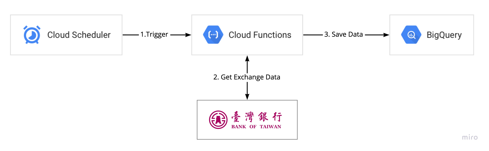

# Taiwan Exchange Rate Sample

透過台銀匯率的小程式，整合 Cloud Functions + Cloud Scheduler + BigQuery

Flow chart


## Setup

```
pip install -r requirements.txt
```

## Test in local

```
export GOOGLE_APPLICATION_CREDENTIALS=<gcp_bigquery_credential_json>
python main.py
```

## Deploy to Cloud Functions

```
gcloud functions deploy exchange_rate --runtime python37 --trigger-http --region=asia-northeast1 --allow-unauthenticated
```

## Setup Cloud Scheduler

```
gcloud scheduler jobs create http exchange_rate_scheduler --schedule "0 20 * * *" --uri "https://asia-northeast1-<project_id>.cloudfunctions.net/exchange_rate" --http-method GET --time-zone=Asia/Taipei
```

## Clean

```
# Remove Scheduler
gcloud scheduler jobs delete exchange_rate_scheduler

# Remove Cloud Functions
gcloud functions delete exchange_rate --region=asia-northeast1

# remove BigQuery
gcloud alpha bq datasets delete taiwan_exchange_rate --remove-tables
```


## Copyright / License
* Copyright (c) 2020 Cloud Ace
* Licensed under [MIT](LICENSE) licenses.
